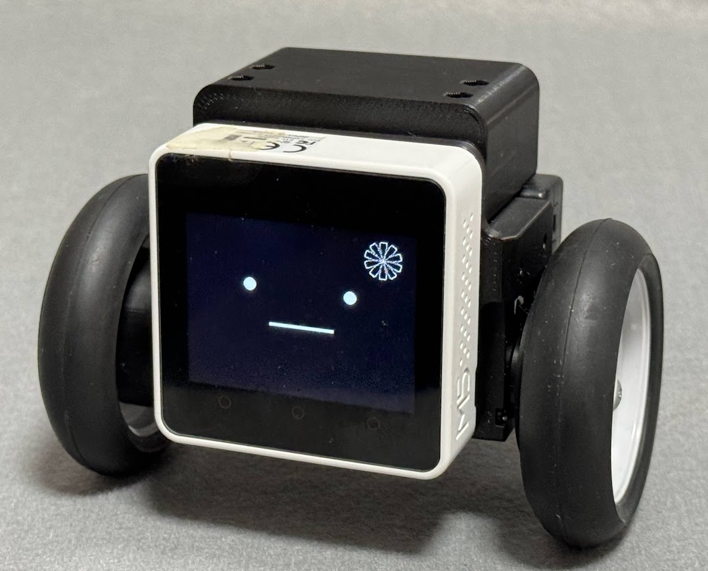
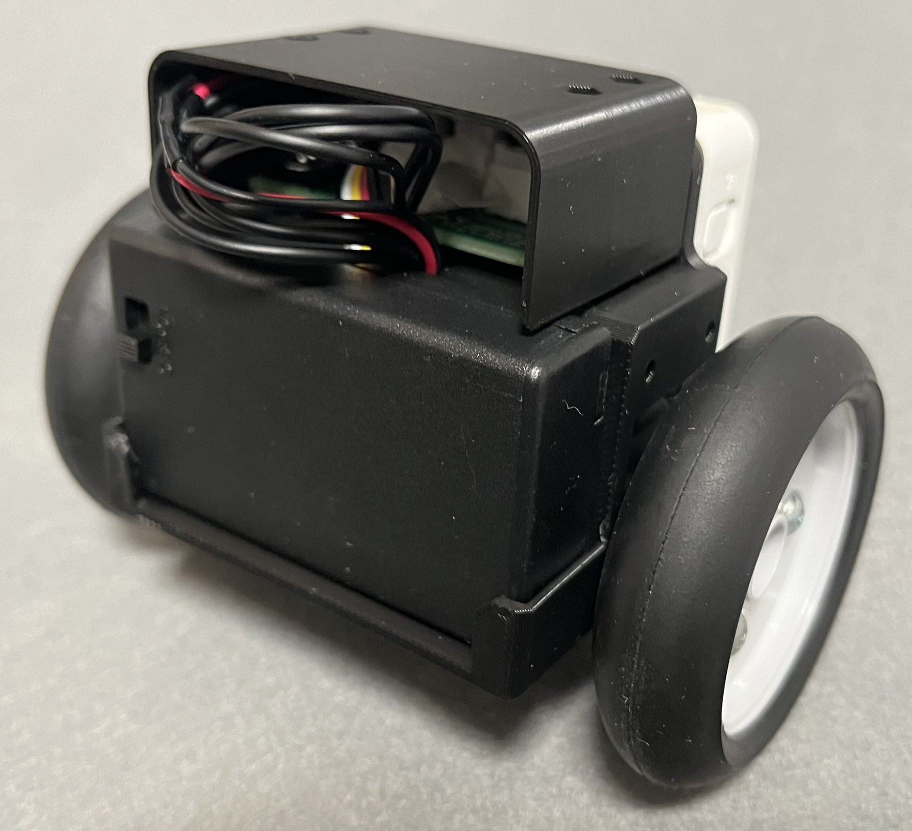

# BSL-Balancer (ﾀｲﾘﾝﾁｬﾝ)

## About
BSL-Balancerは手乗りサイズの学習向け対向二輪型倒立振子です．
M5Stack Core2とDYNAMIXEL XL330を主軸に3Dプリンタ製のボディで構成することで，コストと性能のバランス両立を目指しました．
ｽﾀｯｸﾁｬﾝ*と同じ[m5stack-avatar](https://github.com/meganetaaan/m5stack-avatar)による顔を設定することで親しみやすいデザインに．対向二輪型倒立振子タイプのｽﾀｯｸﾁｬﾝ，「ﾀｲﾘﾝﾁｬﾝ」とお呼びください．画面右上の髪飾りは大輪の花を表しています．

BSL-Balancer is a Palm-sized, two-wheeled inverted pendulum educational use.
By constructing a 3D printed body with M5Stack Core2 and DYNAMIXEL XL330 as the main components, I aimed to achieve a balance between cost and performance.
It has a friendly design with a face created by [m5stack-avatar](https://github.com/meganetaaan/m5stack-avatar), which is the same as stack-chan*. This is a two-wheeled inverted pendulum type Stack Chan, please call me "Tairin-chan".The hair ornament at the top right of the screen represents a "large flower (in japanese, Tairin-no-hana)."

*ｽﾀｯｸﾁｬﾝは[ししかわ](https://twitter.com/stack_chan)さんが開発，公開している， 手乗りサイズのｽｰﾊﾟｰｶﾜｲｲコミュニケーションロボットです．リポジトリ：https://github.com/meganetaaan/stack-chan

*stack-chan is a hand-sized super cute communication robot developed and published by [Shishikawa](https://twitter.com/stack_chan)-san. Repository: https://github.com/meganetaaan/stack-chan

**front**

**back**

## BOM

|     |     |     |     |
| --- | --- | --- | --- |
| **Item** | **Model** | **Qty.** | **Link** |
| MCU | M5Stack Core2  | 1 pc. | [SWITCH SCIENCE](https://ssci.to/9349),   [Sengoku](https://www.sengoku.co.jp/mod/sgk_cart/detail.php?code=EEHD-68G8) |
| Servo Motor  | DYNAMIXEL XL330-M077-T | 2 pcs. | [ROBOTIS e-shop](https://e-shop.robotis.co.jp/product.php?id=416),   [RT-shop](https://www.rt-shop.jp/index.php?main_page=product_info&products_id=3902) |
| Servo IF Board | B-SKY Lab Original Board | 1 pc. | [GitHub](https://github.com/kim-xps12/m5stack_board_dynamixel_ttl_rs3485) |
| Cable | M5STACK-CABLE-10 | 1 pc. | [SWITCH SCIENCE](https://www.switch-science.com/products/5213 "https://www.switch-science.com/products/5213"),   [Sengoku](https://www.sengoku.co.jp/mod/sgk_cart/detail.php?code=EEHD-5CLV) |
| Tire Unit | TAMIYA Narrow Tire | 1 set | [Amazon](https://amzn.asia/d/4A3hlcZ) |
| Battery | AAA Type | 3 pcs. | \-  |
| Battery Box | SBH-431-1AS150 | 1 pc. | [Akizuki](https://akizukidenshi.com/catalog/g/g103196/) |
| Body (3D-Printed Parts) | B-SKY Lab Original parts  | 1 set | This repository |
| Magnet | D=6mm, t=3mm| 4 pcs. | [DAISO](https://jp.daisonet.com/products/4549131156621) |
| M3 Hex Nut | class 1 in JIS | 10 pcs. |-|
| M3 Bolt | L=10mm (for top cover)  | 4 pcs. |-|
| M3 Bolt | L=12mm (for tire)  | 6 pcs. |-|
  

## Environment
- PlatformIO on Visual Studio Code
- ~~Arduino IDE on Windows 11 (please apply M5Stack setting)~~

**NOTE**

このリポジトリではArduino IDEのサポートのサポートを終了しました．
`for_arduino_ide`に以前までのコードを保存しているので，サンプルとしての利用は可能です．
Arduino IDEで開発される場合は，これをベースにPIO向けのコードの内容を手動で反映させることでお使いいただけます．

This repository no longer supports Arduino IDE.
The previous code is saved in `for_arduino_ide`, so it can be used as a example.
If you are developing with Arduino IDE, you can use this as a base by manually reflecting the contents of the code in PIO code.

## Parts 3D-Print and Assembly
- please refer **fron** and **back** view.
- manual: coming soon !

## Usage

### How to stand up

1. 電池ボックスの電源スイッチをONにします
    Turn on the power switch on the battery box.
1. M5Stack Core2の画面が鉛直になるように手で支えて保持します
    Manually hold and support the M5Stack Core2 so that its screen is vertical.
1. M5Stack Core2の電源をONにします
    Turn on the power of the M5Stack Core2.
1. ゆっくりと手を離すと倒立します
    Release your hand and it will stand up.

もし難しい場合は，次の手順を試してみてください．
If you find this difficult, please try the following steps:

1. 先にM5Stack Core2の電源をONにします
    First, turn on the power of the M5Stack Core2.
1. 電池ボックスの電源スイッチをONにします
    Turn on the power switch on the battery box.
1. M5Stack Core2の画面が鉛直になるように手で支えて保持します
    Manually hold and support the M5Stack Core2 so that its screen is vertical.
1. M5Stack Core2のリセットボタン（本体下部側のボタン）を短く押して離します
    Press shortly and release the reset button located at the bottom side of the device.
1. ゆっくりと手を離すと倒立します
    Release your hand and it will stand up.

### How to tune parameters

1. ボタンB（中央）をタップしてコントロールパネルを表示します
    Tap the B button (middle) to display the control panel.
1. [+]ボタンまたは[-]ボタンでパラメータ（P, I, D各ゲインと目標角度）を変更できます
    Use the [+] or [-] buttons to change parameters (P, I, D gains, and target angle).

**NOTE**
設定したパラメータは電源の再投入などのリセットで失われます．EEPROMに保存する機能は今後追加される予定です．

The configured parameters will be lost upon reset, such as when the power is cycled. A feature to save settings to EEPROM will be added in the future.

## Reference

- トランジスタ技術2019年7月号　月着陸船アポロに学ぶ確率統計コンピュータ: [https://cc.cqpub.co.jp/lib/system/doclib\_library/detail/81368/](https://cc.cqpub.co.jp/lib/system/doclib_library/detail/81368/)

- HomeMadeGarbage SHISEIGYO-1DC Plus Recipe: [https://shop.homemadegarbage.com/product/s-1\_dc-plus\_recipe/](https://shop.homemadegarbage.com/product/s-1_dc-plus_recipe/)

- HomeMadeGarbage フルスケールレンジの変更 (MPU6886): [https://homemadegarbage.com/reactionwheel06#%E3%83%95%E3%83%AB%E3%82%B9%E3%82%B1%E3%83%BC%E3%83%AB%E3%83%AC%E3%83%B3%E3%82%B8%E5%A4%89%E6%9B%B4](https://homemadegarbage.com/reactionwheel06#%E3%83%95%E3%83%AB%E3%82%B9%E3%82%B1%E3%83%BC%E3%83%AB%E3%83%AC%E3%83%B3%E3%82%B8%E5%A4%89%E6%9B%B4)

- M5Unified入門 その1 概要確認 #IMU: [https://lang-ship.com/blog/work/m5unified-1/#toc16](https://lang-ship.com/blog/work/m5unified-1/#toc16)

- M5StickCの6軸入力から姿勢を求める(カルマンフィルタ編): [https://shiker.hatenablog.com/entry/2019/08/24/004637](https://shiker.hatenablog.com/entry/2019/08/24/004637)

- M5Stack Core2 内蔵IMU (MPU6886) Datasheet: [https://github.com/m5stack/M5-Schematic/blob/master/datasheet/MPU-6886-000193%2Bv1.1\_GHIC.PDF.pdf](https://github.com/m5stack/M5-Schematic/blob/master/datasheet/MPU-6886-000193%2Bv1.1_GHIC.PDF.pdf)

- Dynamixel2Arduino: [https://github.com/ROBOTIS-GIT/Dynamixel2Arduino](https://github.com/ROBOTIS-GIT/Dynamixel2Arduino)

- M5Unified: [https://github.com/m5stack/M5Unified](https://github.com/m5stack/M5Unified)

- TKJElectronics KalmanFilter Library: [https://github.com/TKJElectronics/KalmanFilter](https://github.com/TKJElectronics/KalmanFilter)

