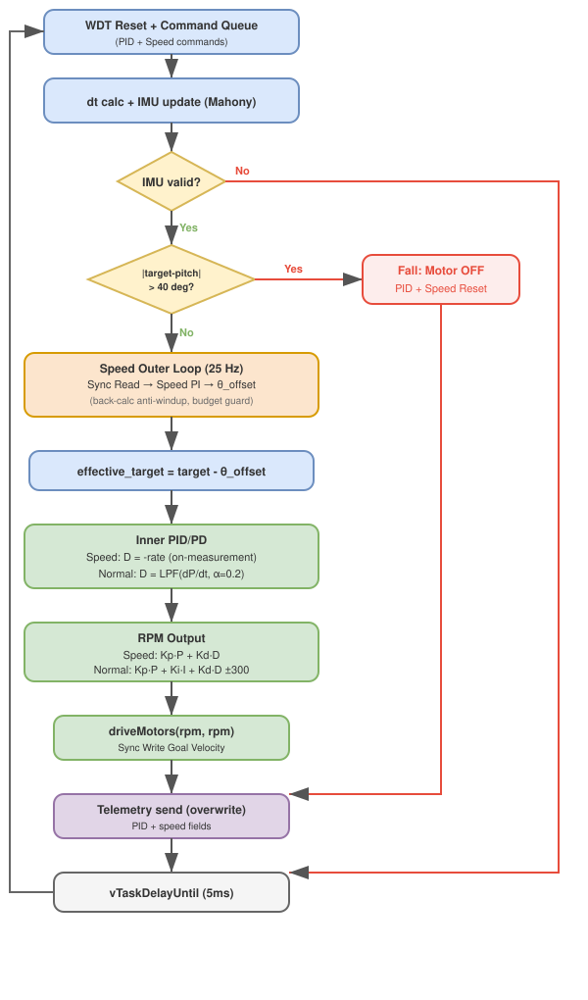

# BSL-Balancer ファームウェア設計ガイド

> **対象読者**: 本プロジェクトに新規アサインされたエンジニア
> **対象コード**: `firmware/bsl-balancer/` 配下の全ソースコード
> **最終更新**: 2026-06-13

---

## 目次

1. [プロジェクト概要](#1-プロジェクト概要)
2. [ハードウェア構成](#2-ハードウェア構成)
3. [ソフトウェアアーキテクチャ](#3-ソフトウェアアーキテクチャ)
4. [ファイル構成と役割](#4-ファイル構成と役割)
5. [初期化シーケンス — main.cpp](#5-初期化シーケンス--maincpp)
6. [制御ループ — control_task.cpp](#6-制御ループ--control_taskcpp)
7. [IMU センサフュージョン — imu_driver.cpp](#7-imu-センサフュージョン--imu_drivercpp)
8. [UI タスク — ui_task.cpp](#8-ui-タスク--ui_taskcpp)
9. [アバター描画 — TairinEye / TairinMouth](#9-アバター描画--tairineye--tairinmouth)
10. [タスク間通信の詳細](#10-タスク間通信の詳細)
11. [定数・設定値一覧](#11-定数設定値一覧)
12. [ビルドと書き込み](#12-ビルドと書き込み)
13. [レガシーコード (Arduino IDE 版) との差分](#13-レガシーコード-arduino-ide-版-との差分)

---

## 1. プロジェクト概要

BSL-Balancer（愛称: ﾀｲﾘﾝﾁｬﾝ）は、**対向二輪型倒立振子ロボット**のファームウェアである。M5Stack Core2 を MCU 兼ディスプレイとして使用し、DYNAMIXEL XL330 サーボモータ2基で車輪を駆動する。PID 制御によるリアルタイム姿勢安定化を行い、タッチパネルによるパラメータ調整機能を備える。

主な特徴:

- **200Hz 制御ループ**: FreeRTOS デュアルコア構成で制御と UI を分離
- **Mahony フィルタ**: 加速度計＋ジャイロスコープの相補フィルタによる姿勢推定
- **転倒検知**: ピッチ偏差 ±40° 超過でモータ即時停止
- **アバター描画部品** (未統合): m5stack-avatar 用カスタム描画クラス（TairinEye/TairinMouth）がソースに含まれるが、現在の main.cpp/ui_task.cpp からは呼び出されていない

---

## 2. ハードウェア構成


### 2.1 構成部品

| コンポーネント | 型番 | 数量 | 役割 |
|---|---|---|---|
| MCU | M5Stack Core2 (ESP32) | 1 | 制御・表示・IMU 内蔵 |
| サーボモータ | DYNAMIXEL XL330-M077-T | 2 | 車輪駆動（速度モード） |
| IF ボード | B-SKY Lab オリジナル | 1 | DYNAMIXEL TTL 通信変換 |
| ケーブル | M5STACK-CABLE-10 | 1 | PORT A 接続 |
| 電池ボックス | SBH-431-1AS150 | 1 | モータ電源 (3×AAA = 4.5V) |
| タイヤ | TAMIYA ナロータイヤ | 1 セット | 走行用 |
| 筐体 | 3D プリンタ製パーツ | 1 セット | `case/` ディレクトリ内 STL |

### 2.2 通信インタフェース

| バス | ピン | ボーレート | 用途 |
|---|---|---|---|
| UART1 (Serial1) | GPIO32 (TX) / GPIO33 (RX) | 1,000,000 bps | DYNAMIXEL 制御 |
| I2C (内部) | — | — | MPU-6886 IMU / バッテリ監視 |
| USB (Serial0) | — | 115,200 bps | デバッグ用テレメトリ出力 |

### 2.3 M5Stack Core2 内蔵ペリフェラル

- **IMU**: MPU-6886 (3 軸加速度 + 3 軸ジャイロ)
- **LCD**: ILI9342C 320×240px カラーディスプレイ
- **タッチ**: FT6336U 静電容量式タッチパネル (I2C addr 0x38)
- **電源管理**: AXP192 PMIC (バッテリ残量取得可能)

---

## 3. ソフトウェアアーキテクチャ


### 3.1 デュアルコア・タスク構成

ESP32 のデュアルコアを活用し、FreeRTOS タスクを以下のように分離している:

| タスク | Core | 優先度 | 周期 | スタック | 役割 |
|---|---|---|---|---|---|
| `controlLoopTask` | Core 1 (APP_CPU) | 20 | 5ms (200Hz) | 8192 bytes | IMU 読取・PID 制御・モータ駆動 |
| `uiLoopTask` | Core 0 (PRO_CPU) | 3 | 50ms (20Hz) | 8192 bytes | タッチ入力・画面描画・テレメトリ |

制御タスクが最高優先度で、UI タスクに割り込まれることはない。

### 3.2 タスク間通信機構

タスク間の通信には FreeRTOS のプリミティブを3つ使用する:

1. **`g_cmd_queue`** (深さ 8): UI → Control 方向のパラメータ変更指令
2. **`g_telemetry_queue`** (深さ 1, 上書き): Control → UI 方向の状態データ
3. **`g_i2c_mutex`**: I2C バスの排他制御（IMU 読取とバッテリ監視の衝突防止）

### 3.3 ウォッチドッグ

制御タスクは `esp_task_wdt` により 1 秒のウォッチドッグタイマーで監視される。制御ループが 1 秒以内に `esp_task_wdt_reset()` を呼ばないと MCU がリセットされる。

---

## 4. ファイル構成と役割

```
firmware/bsl-balancer/
├── platformio.ini          # ビルド設定・ライブラリ依存
├── include/
│   ├── config.h            # ハードウェア定数・PID デフォルト値
│   ├── shared_state.h      # タスク間通信の構造体・キュー宣言
│   └── imu_driver.h        # IMU ドライバ (Mahony フィルタ) ヘッダ
├── src/
│   ├── main.cpp            # エントリポイント: 初期化 + タスク生成
│   ├── control_task.cpp    # 制御ループ: PID + 転倒検知 + モータ駆動
│   ├── ui_task.cpp         # UI ループ: タッチ操作 + テレメトリ
│   ├── imu_driver.cpp      # Mahony 相補フィルタ実装
│   ├── TairinEye.h/.cpp    # カスタム目描画 (m5avatar 拡張)
│   └── TairinMouth.h/.cpp  # カスタム口描画 (m5avatar 拡張)
├── case/                   # 3D プリンタ用 STL ファイル
├── docs/                   # ドキュメント・写真
└── for_arduino_ide/        # [非推奨] Arduino IDE 版レガシーコード
```

### ライブラリ依存 (platformio.ini)

| ライブラリ | バージョン | 用途 |
|---|---|---|
| `Dynamixel2Arduino` | ^0.8.1 | DYNAMIXEL プロトコル 2.0 通信 |
| `M5Unified` | ^0.2.7 | M5Stack 統一 HAL (IMU, LCD, 電源) |
| `M5Stack-Avatar` | ^0.9.2 | 顔アニメーション描画 |

---

## 5. 初期化シーケンス — main.cpp

`setup()` 関数が以下の順序で初期化を行う:

### 5.1 M5Stack Core2 初期化

```cpp
auto cfg = M5.config();
cfg.internal_imu = true;   // IMU 有効化
M5.begin(cfg);
```

RTC, マイク, スピーカーは無効化し、IMU のみ有効にする。

### 5.2 FreeRTOS プリミティブ生成

```cpp
g_i2c_mutex      = xSemaphoreCreateMutex();       // I2C 排他制御
g_cmd_queue      = xQueueCreate(8, sizeof(CtrlCommand));     // コマンドキュー
g_telemetry_queue = xQueueCreate(1, sizeof(TelemetryData));  // テレメトリキュー
```

すべて `configASSERT` で生成成功を検証する。失敗時は MCU が停止する。

### 5.3 DYNAMIXEL 初期化

```cpp
HardwareSerial& dxl_serial = Serial1;
dxl_serial.begin(DXL_BAUDRATE, SERIAL_8N1, PIN_RX_SERVO, PIN_TX_SERVO);
dxl = Dynamixel2Arduino(dxl_serial);
dxl.begin(DXL_BAUDRATE);
dxl.setPortProtocolVersion(DXL_PROTOCOL_VERSION);
if (!dxl.ping(DXL_ID_L)) { M5.Lcd.println("DXL L ping FAIL"); }
if (!dxl.ping(DXL_ID_R)) { M5.Lcd.println("DXL R ping FAIL"); }
dxl.torqueOff(DXL_ID_L);
dxl.torqueOff(DXL_ID_R);
dxl.setOperatingMode(DXL_ID_L, OP_VELOCITY);
dxl.setOperatingMode(DXL_ID_R, OP_VELOCITY);
dxl.torqueOn(DXL_ID_L);
dxl.torqueOn(DXL_ID_R);
```

1. UART1 を 1Mbps で開く（PORT A: GPIO32/33）
2. `Dynamixel2Arduino` インスタンスにシリアルポートを割り当て、通信開始
3. 各モータに ping を送信し接続確認（失敗時は LCD にエラー表示）
4. トルク OFF → 速度モード設定 → トルク ON の順で設定

### 5.4 IMU キャリブレーション

```cpp
imuDriver.calibrate(500, 0.5f);
```

500 サンプルの加速度ピッチ角を平均して初期姿勢推定値とする。標準偏差が 0.5° を超える場合は振動警告をシリアル出力する。

### 5.5 タスク生成

```cpp
esp_task_wdt_init(1, true);  // WDT 1秒, パニック有効
xTaskCreatePinnedToCore(controlLoopTask, "Control", 8192, NULL, 20, NULL, 1);
xTaskCreatePinnedToCore(uiLoopTask,      "UI",      8192, NULL, 3,  NULL, 0);
```

Arduino の `loop()` は空。すべての処理は FreeRTOS タスクで実行される。

---

## 6. 制御ループ — control_task.cpp

200Hz (5ms 周期) で実行される倒立制御の中核タスク。



### 6.1 ループ構造

各反復で以下を順に実行する:

1. **WDT リセット** — `esp_task_wdt_reset()`
2. **コマンドキュー処理** — UI からの Kp/Ki/Kd/Target 変更をノンブロッキングで全消費
3. **Δt 計算** — `esp_timer_get_time()` による実測、2ms〜50ms にクランプ
4. **IMU 更新** — Mahony フィルタで姿勢推定（後述）
5. **転倒判定** — ピッチ偏差 ±40° で転倒と判定
6. **PID 計算** — 正常時のみ実行
7. **モータ駆動** — RPM 値を DYNAMIXEL に送信
8. **テレメトリ送信** — 上書きキューで最新値を UI タスクに提供
9. **待機** — `vTaskDelayUntil()` で周期精度を保証

### 6.2 PID 制御の詳細

#### P 項 (比例)

```
P = target - pitch_filtered
```

偏差そのもの。`target` のデフォルトは 86.0°（機体の垂直姿勢に対応）。

#### I 項 (積分) — アンチワインドアップ付き

```
I_acc += P * dt
i_limit = 50.0 / (|ki| + 1e-6)
I_acc = clamp(I_acc, -i_limit, i_limit)
```

積分値を `ki * I_acc` の絶対値が 50 RPM を超えない範囲に制限する。これにより転倒後の復帰時に積分巻き上げ (windup) が発生しない。

#### D 項 (微分) — ローパスフィルタ付き

```
D_raw = (P - preP) / dt
D_filtered = 0.2 * D_raw + 0.8 * D_filtered
```

1 次 IIR ローパスフィルタ (α=0.2) で高周波ノイズを抑制する。初回反復 (`pid_active == false`) では D 項をゼロにする。

#### 出力計算

```
rpm = Kp * P + Ki * I_acc + Kd * D_filtered
rpm_motor = constrain(rpm, -300, 300)
```

計算結果を ±300 RPM に制限してモータへ送信する。

### 6.3 転倒検知と復帰

ピッチ偏差が ±40° を超えると:

1. モータを即時停止 (`driveMotors(0, 0)`)
2. PID 内部状態をリセット (`I_acc = 0, preP = 0, D_filtered = 0`)
3. 速度制御状態をリセット (`speed_enabled = false`, `v_d = 0`, `yaw_rate_cmd = 0`, 積分項・計測値クリア)
4. `pid_active = false` にして、復帰時の D 項スパイクを防止
5. テレメトリに `fallen = true` を設定して送信

偏差が ±40° 以内に戻ると自動的に制御を再開する。

### 6.4 モータ駆動関数

```cpp
static void driveMotors(int rpm_L, int rpm_R) {
    // Sync Write で左右同時に Goal Velocity を書き込み（非ブロッキング）
    int32_t raw_L = (int32_t)(-rpm_L / DXL_VEL_UNIT);
    int32_t raw_R = (int32_t)( rpm_R / DXL_VEL_UNIT);
    memcpy(goal_vel_buf_L, &raw_L, 4);
    memcpy(goal_vel_buf_R, &raw_R, 4);
    vel_sync_write.is_info_changed = true;
    dxl.syncWrite(&vel_sync_write);
}
```

`Sync Write` パケットにより左右モータへ同時に Goal Velocity を送信する。左右のモータは逆方向に取り付けられているため、左モータに `-rpm` を指令する。速度制御有効時はヨーレート指令に基づく差動ミキシングが適用される。

---

## 7. IMU センサフュージョン — imu_driver.cpp

### 7.1 Mahony 相補フィルタ

加速度計とジャイロスコープを融合して安定したピッチ角推定を行う。1 次元（ピッチ軸のみ）の簡略版を実装している。

#### アルゴリズム

```
accel_pitch = atan2(ay, az)                    // 加速度からのピッチ角
error       = accel_pitch - pitch_est          // 推定値との誤差

gyro_bias  += KI_MAHONY * error * dt           // ジャイロバイアス補正（積分）
gyro_corr   = gx + KP_MAHONY * error + gyro_bias  // 補正済みジャイロ角速度

pitch_est  += gyro_corr * dt                   // 姿勢推定値の更新
```

#### パラメータ

| 定数 | 値 | 役割 |
|---|---|---|
| `KP_MAHONY` | 2.0 | 比例ゲイン — 加速度計への追従速度 |
| `KI_MAHONY` | 0.005 | 積分ゲイン — ジャイロドリフト補正速度 |

KP が大きいほど加速度計の影響が強く振動に弱い。KI はジャイロのゆっくりしたドリフトを補正する。

### 7.2 I2C 排他制御

IMU の読み取りは I2C 経由で行うため、`g_i2c_mutex` を 2ms タイムアウトで取得する。取得できない場合は `valid = false` を返し、制御ループはその反復をスキップする。

```cpp
if (xSemaphoreTake(_i2c_mutex, pdMS_TO_TICKS(2)) != pdTRUE) {
    return {0, 0, false};  // mutex 取得失敗 → スキップ
}
auto mask = M5.Imu.update();
xSemaphoreGive(_i2c_mutex);
```

### 7.3 キャリブレーション

起動時に `calibrate()` が呼ばれ、以下を行う:

1. 500 サンプルの加速度ピッチ角を 2ms 間隔で収集
2. 平均値を初期 `pitch_est` として設定
3. ジャイロバイアスをゼロにリセット
4. 標準偏差が閾値 (0.5°) を超えた場合はシリアルに警告出力

---

## 8. UI タスク — ui_task.cpp

20Hz (50ms 周期) で実行される画面表示・入力処理タスク。

### 8.1 タッチパネルによるパラメータ調整

ボタン B（中央）を押すとコントロールパネルが表示される。各パラメータに [−] / [+] ボタンが配置され、タッチで 0.2 ずつ増減できる:

| パラメータ | 画面ラベル | デフォルト値 | 説明 |
|---|---|---|---|
| `pitch_target` | Ref | 86.0° | 目標ピッチ角（垂直姿勢） |
| `kp` | Kp | 15.0 | 比例ゲイン |
| `ki` | Ki | 0.05 | 積分ゲイン |
| `kd` | Kd | 0.0 | 微分ゲイン（デフォルト無効） |

変更は `CtrlCommand` 構造体としてキューに送信され、制御タスクが次の反復で反映する。

### 8.2 テレメトリ出力

100ms 間隔でシリアル (USB) に以下の形式でテレメトリを出力する:

```
>pitch:86.12
>rate:-0.34
>rpm:5.0
>P:0.12
>I:0.003
>D:0.02
>loop_us:312
```

`>` プレフィックス付きのフォーマットは、シリアルプロッタ対応の形式。

### 8.3 バッテリ残量表示

コントロールパネル表示中、`M5.Power.getBatteryLevel()` でバッテリ残量を取得して画面下部に表示する。この呼び出しは I2C 経由のため `g_i2c_mutex` で保護されている。

### 8.4 M5.update() の排他制御

`M5.update()` は内部で I2C を使用するため（ボタン状態読み取り等）、mutex 取得下で呼び出す:

```cpp
if (xSemaphoreTake(g_i2c_mutex, pdMS_TO_TICKS(10)) == pdTRUE) {
    M5.update();
    xSemaphoreGive(g_i2c_mutex);
}
```

---

## 9. アバター描画 — TairinEye / TairinMouth

m5stack-avatar ライブラリの `Drawable` インタフェースを継承したカスタムコンポーネント。ロボットの顔表示を担当する。

### 9.1 TairinEye (目)

- **開眼時**: `fillCircle()` で円形の目を描画
- **閉眼時**: `fillRect()` で水平線（まばたき）を描画
- **視線追従**: `Gaze` オブジェクトの水平/垂直成分に応じて ±3px のオフセット

#### 花飾り描画

画面右上に「大輪の花」（ﾀｲﾘﾝ = 大輪）モチーフの装飾を描画する:

```
r = |a·sin(nθ) + b·sin(3nθ) + c·sin(5nθ)|
```

パラメータ: n=5（花弁は 2n=10 枚）、a=30, b=6, c=1。バラ曲線（rose curve）の変種を極座標からデカルト座標に変換して描画する。

`en_draw_flower` フラグにより 1 フレーム置きに描画し、アニメーション時の線の重複を防ぐ。

### 9.2 TairinMouth (口)

`openRatio` に応じて矩形の口を描画する:

- `openRatio = 0`: 最小幅 (`maxWidth`) × 最小高 (`minHeight`) → 閉じた口
- `openRatio = 1`: 最小幅 (`minWidth`) × 最大高 (`maxHeight`) → 開いた口
- `breath` パラメータにより Y 方向に微小な揺れアニメーションを付与

---

## 10. タスク間通信の詳細

### 10.1 CtrlCommand 構造体

```cpp
enum class CtrlCommandType : uint8_t {
    SET_PITCH_TARGET, SET_KP, SET_KI, SET_KD,
    SET_SPEED_ENABLED,   // value > 0.5 で速度制御 ON、≤ 0.5 で OFF
    SET_KP_SPEED,        // 速度 PI の Kp
    SET_KI_SPEED,        // 速度 PI の Ki
    SET_VELOCITY_CMD,    // 目標並進速度 [m/s]（±V_CMD_MAX でクランプ）
    SET_YAW_RATE_CMD,    // 目標ヨーレート [rad/s]
};
struct CtrlCommand {
    CtrlCommandType type;
    float value;
};
```

UI タスクがパラメータ変更時に `xQueueSend()` でキューに投入する。制御タスクはループ先頭で `xQueueReceive()` をノンブロッキング (`timeout=0`) で全メッセージを消費する。キュー深さ 8 のため、1 制御周期 (5ms) で最大 8 件のパラメータ変更を処理できる。

速度制御コマンド (`SET_VELOCITY_CMD` / `SET_YAW_RATE_CMD`) は `CMD_FRESHNESS_MS` 以内に再送されなければデッドマンタイムアウトで速度制御が自動停止する。`SET_SPEED_ENABLED` 受信時にもタイマーがリフレッシュされる。

### 10.2 TelemetryData 構造体

```cpp
struct TelemetryData {
    float pitch_deg;        // 推定ピッチ角 [deg]
    float pitch_rate_dps;   // ピッチ角速度 [deg/s]
    float rpm_cmd;          // モータ RPM 指令値
    float P_term, I_term, D_term;  // PID 各項
    uint32_t loop_us;       // 制御ループ実行時間 [us]
    bool fallen;            // 転倒フラグ
    float v_measured;       // 計測車輪速度 [m/s]
    float theta_offset;     // 速度 PI 出力のピッチオフセット [deg]
    float v_error;          // 速度誤差 [m/s]
    float v_integral;       // 速度積分項
    uint32_t sync_read_us;  // Sync Read 所要時間 [us]
    bool speed_enabled;     // 速度制御有効フラグ
};
```

制御タスクが `xQueueOverwrite()` で最新値を常に上書きする。UI タスクは `xQueuePeek()` で読み取る（キューから消費しない）。これにより:

- 制御タスクはキュー満杯でブロックされない
- UI タスクは常に最新のテレメトリを取得できる
- 読み取りタイミングが制御周期と非同期でも問題ない

### 10.3 I2C Mutex

I2C バスは以下の 2 つのコンテキストで使用される:

| 使用元 | 用途 | タイムアウト |
|---|---|---|
| `imuDriver.update()` (Control) | IMU データ読み取り | 2ms |
| `M5.update()` / `getBatteryLevel()` (UI) | ボタン状態 / バッテリ残量 | 10ms |

制御タスクのタイムアウトが短い (2ms) のは、制御周期 (5ms) に対して遅延を最小化するため。取得失敗時は IMU データを `invalid` として返し、その反復の制御計算をスキップする。

---

## 11. 定数・設定値一覧

### config.h で定義される定数

| 定数名 | 値 | 説明 |
|---|---|---|
| `PIN_RX_SERVO` | GPIO33 | DYNAMIXEL UART RX ピン |
| `PIN_TX_SERVO` | GPIO32 | DYNAMIXEL UART TX ピン |
| `DEFAULT_KP` | 15.0 | PID 比例ゲインのデフォルト値 |
| `DEFAULT_KI` | 0.05 | PID 積分ゲインのデフォルト値 |
| `DEFAULT_KD` | 0.0 | PID 微分ゲインのデフォルト値（無効） |
| `DEFAULT_PITCH_TARGET` | 86.0° | 目標ピッチ角のデフォルト値 |
| `CTRL_PERIOD_TICKS` | 5ms (200Hz) | 制御ループ周期 |
| `DXL_ID_L` / `DXL_ID_R` | 0 / 1 | 左右モータの DYNAMIXEL ID |
| `DXL_PROTOCOL_VERSION` | 2.0 | DYNAMIXEL プロトコルバージョン |
| `DXL_BAUDRATE` | 1,000,000 bps | DYNAMIXEL 通信速度 |
| `FALL_THRESHOLD_DEG` | 40.0° | 転倒判定閾値 |
| `RPM_LIMIT` | 300 | モータ回転数制限 |

### Mahony フィルタ定数 (imu_driver.h)

| 定数名 | 値 | 説明 |
|---|---|---|
| `KP_MAHONY` | 2.0 | フィルタ比例ゲイン |
| `KI_MAHONY` | 0.005 | フィルタ積分ゲイン |

### その他の制御パラメータ (control_task.cpp 内)

| パラメータ | 値 | 説明 |
|---|---|---|
| dt クランプ範囲 | 2ms〜50ms | 異常な Δt の除外 |
| I 項上限 | `50 / |ki|` RPM | アンチワインドアップ制限 |
| D 項フィルタ係数 | α = 0.2 | 1 次 IIR LPF の新値重み |

---

## 12. ビルドと書き込み

### 12.1 環境構築

1. [PlatformIO IDE](https://platformio.org/) を VSCode にインストール
2. 本リポジトリを clone
3. `firmware/bsl-balancer/` を VSCode で開く

### 12.2 ビルド・書き込み

```bash
# ビルド
cd firmware/bsl-balancer
pio run

# 書き込み（M5Stack Core2 を USB 接続した状態で）
pio run --target upload

# シリアルモニタ
pio device monitor --baud 115200
```

### 12.3 事前準備

書き込み前に DYNAMIXEL XL330 のボーレートを **1,000,000 bps** に設定しておく必要がある。設定には [m5core2_dynamixel_wizard](https://github.com/kim-xps12/m5core2_dynamixel_wizard) が利用できる。

---

## 13. レガシーコード (Arduino IDE 版) との差分

`for_arduino_ide/for_arduino_ide.ino` は初期実装の単一ファイル版で、現在は**非推奨**。現行 PlatformIO 版との主要な差分:

| 項目 | レガシー (Arduino IDE) | 現行 (PlatformIO) |
|---|---|---|
| ファイル構成 | 単一 .ino ファイル | マルチファイル (8 ファイル) |
| 姿勢推定 | Kalman フィルタ (外部ライブラリ) | Mahony 相補フィルタ (自前実装) |
| 制御周期 | 10ms (100Hz) | 5ms (200Hz) |
| DYNAMIXEL ボーレート | 2,000,000 bps | 1,000,000 bps |
| UART ピン | GPIO32(RX)/GPIO33(TX) | GPIO33(RX)/GPIO32(TX) ※逆 |
| I2C 排他制御 | なし | `g_i2c_mutex` で排他制御 |
| コマンドキュー | なし（グローバル変数直書き） | `g_cmd_queue` (FreeRTOS Queue) |
| テレメトリ | なし | `g_telemetry_queue` + シリアル出力 |
| WDT | なし | 1 秒タイムアウト |
| アンチワインドアップ | `|I * Ki| > 200` で I=0 リセット | `I_acc` を連続的にクランプ |
| D 項フィルタ | なし（生の微分値） | 1 次 IIR LPF (α=0.2) |
| アバター | なし | TairinEye / TairinMouth |
| パラメータ保存 | Preferences (NVS) 使用の痕跡あり | 未実装（リセットで消失） |

### 主な改善点

1. **スレッドセーフティ**: グローバル変数の直接共有から FreeRTOS キュー/ミューテックスへ
2. **センサフュージョン**: 外部 Kalman ライブラリから軽量な Mahony フィルタへ
3. **制御品質**: D 項フィルタ、連続アンチワインドアップ、2倍の制御レート
4. **保守性**: マルチファイル構成、関心の分離
5. **信頼性**: WDT による異常検知、I2C 排他制御

---

## 付録: テレメトリの読み方

シリアルモニタで出力されるテレメトリの各フィールド:

```
>pitch:86.12    ← 推定ピッチ角 [deg]。86° 付近で安定が正常
>rate:-0.34     ← ピッチ角速度 [deg/s]。0 付近で安定
>rpm:5.0        ← モータ指令 RPM。正=前進方向
>P:0.12         ← PID P項（偏差そのもの）
>I:0.003        ← PID I項（積分蓄積値）
>D:0.02         ← PID D項（フィルタ済み微分値）
>loop_us:312    ← 制御ループ実行時間 [μs]。5000μs 以下が正常
```
